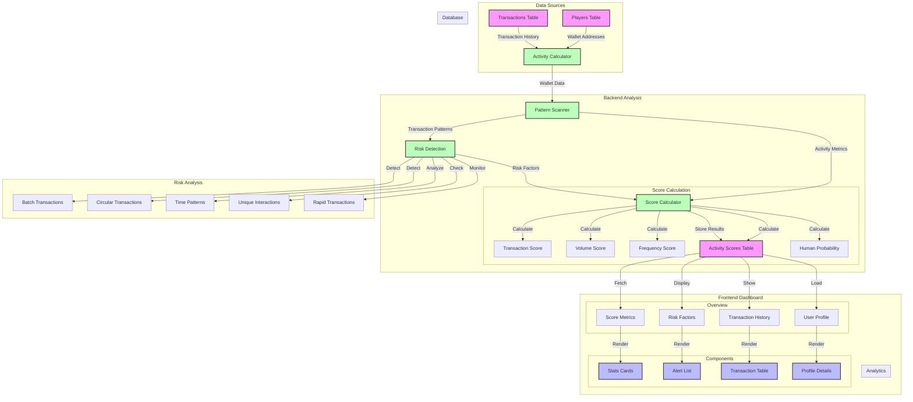

# Anti-Sybil Dashboard

## Overview

A real-time blockchain analysis tool that helps identify potentially fraudulent behavior and Sybil attacks in Web3 gaming environments. The system analyzes user transaction patterns, interaction behaviors, and account characteristics to assign risk scores and detect suspicious activities.



### User Score

Implementation of tracking positive user score based on their on-chain.

### Sybil Detection Methodology

Implementation of Anti-Sybil measures to combat airdrop farming, bots:

1.  Pattern Recognition - Detects automated transactions by analyzing time intervals between consecutive transactions
2.  Network Analysis of circular transactions - Identifies potential money cycling between accounts
3.  Batch Detection - Identifies automated transaction patterns with identical amounts

## Features

- Example Web3 game db ✅

- Mock data generation for users and transactions ✅

- Real-time new db record detection and score update ✅

- User positive activity score calculation ✅

- User negative(possible sybil) score calculation ✅

- Dashboard for data visualization ✅

## Integration with

- Using your preferred library e.g. `Ethers`, `Viem, `Web3.js` for every block on BSC fetch all txs and filter them by interactions with your smart contracts, tokens, in-game NFTs or between your players. Individual transaction should be saved into Supabase.

- On registration or first interaction with your game smart contracts the user should be added to the players table.

- Now complete setup to run the backend service, frontend and prepare supabase.

## Setup

### Backend

- Run `npm i` inside `/backend` directory in order to install dependenies.

- Create new Supabase project and fill out `.env` variables with your url and api key.

- Run SQL queries inside your supabase SQL editor to initialize it:

```SQL
        CREATE TABLE IF NOT EXISTS public.players (
          id UUID PRIMARY KEY DEFAULT gen_random_uuid(),
          wallet_address VARCHAR NOT NULL UNIQUE,
          username VARCHAR NOT NULL,
          level INTEGER DEFAULT 1,
          experience_points INTEGER DEFAULT 0,
          created_at TIMESTAMP WITH TIME ZONE DEFAULT TIMEZONE('utc', NOW()),
          total_transactions INTEGER DEFAULT 0
        );

        CREATE TABLE IF NOT EXISTS public.transactions (
          id UUID PRIMARY KEY DEFAULT gen_random_uuid(),
          from_address VARCHAR NOT NULL,
          to_address VARCHAR NOT NULL,
          amount DECIMAL NOT NULL,
          transaction_type VARCHAR NOT NULL,
          timestamp TIMESTAMP WITH TIME ZONE DEFAULT TIMEZONE('utc', NOW())
        );

        CREATE TYPE risk_level AS ENUM ('LOW', 'MEDIUM', 'HIGH');

CREATE TABLE IF NOT EXISTS public.activity_scores (
    id UUID PRIMARY KEY DEFAULT gen_random_uuid(),
    wallet_address VARCHAR NOT NULL UNIQUE,
    total_score DECIMAL NOT NULL,
    transaction_score DECIMAL NOT NULL,
    volume_score DECIMAL NOT NULL,
    frequency_score DECIMAL NOT NULL,
    age_score DECIMAL NOT NULL,
    active_days INTEGER NOT NULL,
    total_volume DECIMAL NOT NULL,
    transaction_count INTEGER NOT NULL,
    risk_level risk_level NOT NULL,
    risk_factors JSONB DEFAULT '[]',
    human_probability INTEGER NOT NULL DEFAULT 50,
    unique_interactions_count INTEGER DEFAULT 0,
    circular_transactions_count INTEGER DEFAULT 0,
    first_tx_date TIMESTAMP WITH TIME ZONE,
    last_tx_date TIMESTAMP WITH TIME ZONE,
    calculated_at TIMESTAMP WITH TIME ZONE DEFAULT TIMEZONE('utc', NOW())
);

CREATE INDEX IF NOT EXISTS idx_activity_scores_wallet ON activity_scores(wallet_address);
CREATE INDEX IF NOT EXISTS idx_activity_scores_risk ON activity_scores(risk_level);
CREATE INDEX IF NOT EXISTS idx_activity_scores_human_prob ON activity_scores(human_probability);

CREATE OR REPLACE FUNCTION update_calculated_at()
RETURNS TRIGGER AS $$
BEGIN
    NEW.calculated_at = TIMEZONE('utc', NOW());
    RETURN NEW;
END;
$$ LANGUAGE plpgsql;

CREATE TRIGGER update_activity_scores_timestamp
    BEFORE UPDATE ON activity_scores
    FOR EACH ROW
    EXECUTE FUNCTION update_calculated_at();

CREATE OR REPLACE VIEW high_risk_accounts AS
SELECT
    wallet_address,
    total_score,
    human_probability,
    risk_level,
    risk_factors,
    unique_interactions_count,
    circular_transactions_count,
    transaction_count,
    calculated_at
FROM activity_scores
WHERE risk_level = 'HIGH'
OR human_probability < 40
ORDER BY human_probability ASC, total_score ASC;

CREATE OR REPLACE FUNCTION get_risk_summary(address VARCHAR)
RETURNS TABLE (
    wallet_address VARCHAR,
    risk_level risk_level,
    human_probability INTEGER,
    risk_factors JSONB,
    unique_interactions_count INTEGER,
    transaction_patterns JSON
) AS $$
BEGIN
    RETURN QUERY
    SELECT
        a.wallet_address,
        a.risk_level,
        a.human_probability,
        a.risk_factors,
        a.unique_interactions_count,
        json_build_object(
            'circular_transactions', a.circular_transactions_count,
            'total_transactions', a.transaction_count,
            'active_days', a.active_days
        ) as transaction_patterns
    FROM activity_scores a
    WHERE a.wallet_address = address;
END;
$$ LANGUAGE plpgsql;
```

- Enable **Realtime** for every table in the Supabase UI(this is needed for transaction listener).

- Run `mockupGenerator` to generate initial mockup data for the players and transactions.

- Run `npm run start` to run transaction listener and score updater.

### Frontend

- Move to /frontend directory

- Install dependencies with `npm i`.

- Fill out `.env` with your variables.

- Run web app with `npm run dev`.
